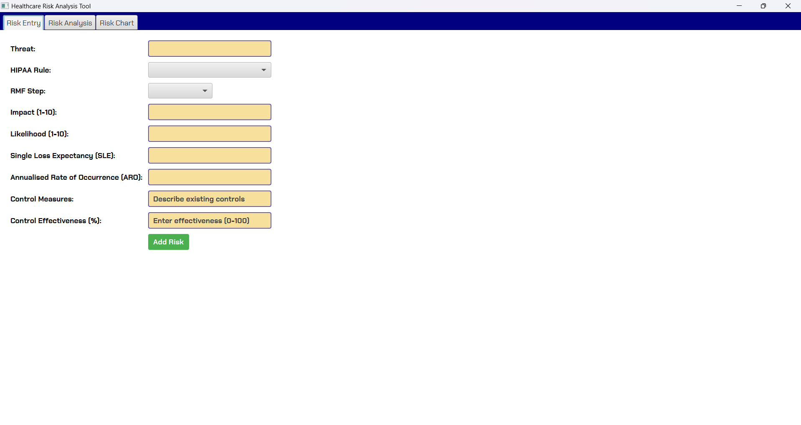
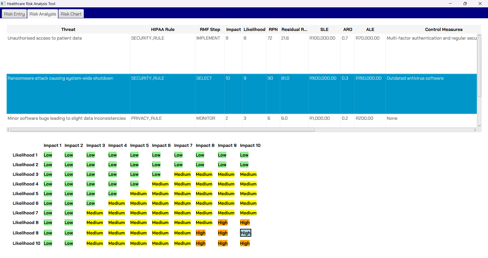
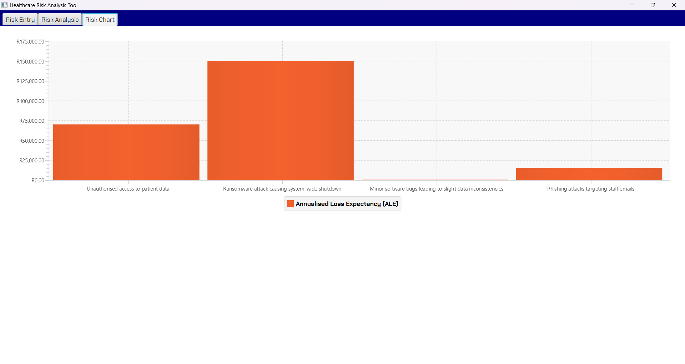

# Healthcare Risk Analysis Tool

## Overview
The **Healthcare Risk Analysis Tool** is designed to help healthcare organizations assess, analyze, and mitigate cybersecurity risks. It uses the **NIST Risk Management Framework (RMF)** and provides tailored risk mitigation recommendations based on user inputs. The tool allows organizations to prioritize risks by calculating the **Risk Priority Number (RPN)**, **Annualized Loss Expectancy (ALE)**, and residual risk.

## Features
- **Risk Entry:** Users can input various risks and define their attributes such as impact, likelihood, control measures, and effectiveness.
- **Risk Matrix:** A visual matrix that categorizes risks based on impact and likelihood.
- **Risk Chart:** A bar chart that visualizes financial loss using ALE.
- **Recommendations:** Provides tailored recommendations based on HIPAA guidelines and the NIST RMF.

## Technologies Used
- **JavaFX**: For building the graphical user interface (GUI).
- **Java**: The primary programming language for the tool.
- **Maven**: For managing dependencies and building the project.

## Installation
To set up the project locally:
1. Clone this repository:
    ```bash
    git clone https://github.com/your-username/healthcare-risk-analysis-tool.git
    ```
2. Navigate into the project directory:
    ```bash
    cd healthcare-risk-analysis-tool
    ```
3. Build the project using Maven:
    ```bash
    mvn clean install
    ```
4. Run the application:
    ```bash
    mvn javafx:run
    ```

## Usage
1. **Add a Risk**: Go to the "Risk Entry" tab and input a new risk with details such as Impact, Likelihood, and control measures.
2. **Analyze the Risk**: In the "Risk Analysis" tab, view the risk matrix and see how risks are classified based on their severity.
3. **Visualize Financial Impact**: Use the "Risk Chart" tab to see the potential financial impact using ALE.
4. **Get Recommendations**: Based on the input, the tool will provide security recommendations to help mitigate risks.

## Screenshots




## Future Improvements
- Integration of AI-based recommendations for more dynamic mitigation strategies.
- Enhanced real-time monitoring and risk prediction capabilities.

## License
This project is licensed under the MIT License - see the [LICENSE](LICENSE) file for details.

## Contributions
Feel free to open an issue or submit a pull request with any suggestions or improvements.

